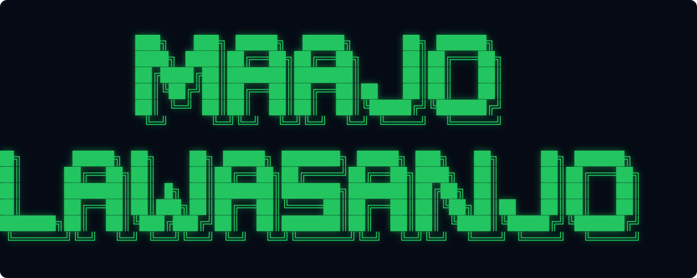
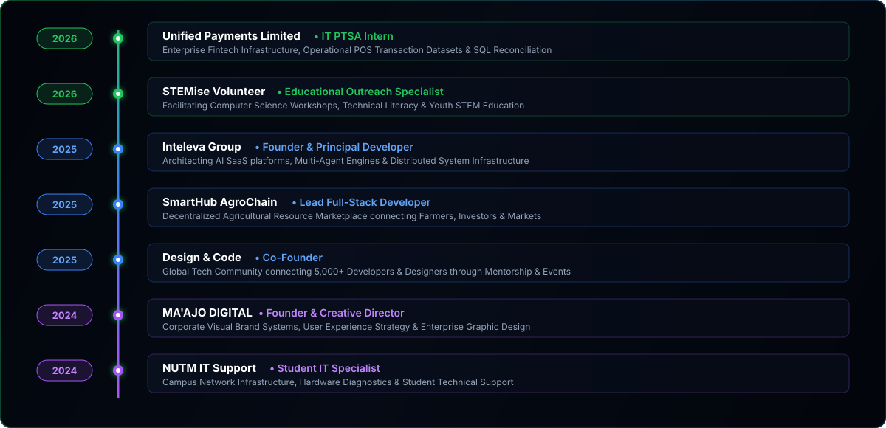
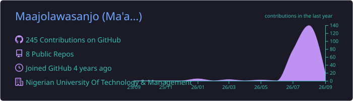
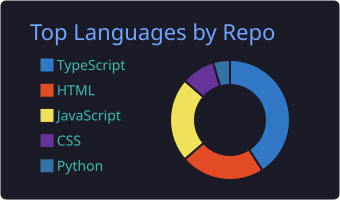
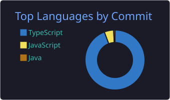
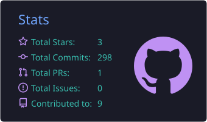

<!--
================================================================================
  MA'AJO LAWASANJO NATHAN — GITHUB PROFILE README
  Design System: Emerald Green (#22c55e) & Midnight Blue (#0a1122)
  Aligned with: maajo-lawasanjo.vercel.app
================================================================================
-->

<div align="center">

<!-- 01. STANDALONE THICK BLOCK ASCII NAME BANNER -->


<br />

<!-- ROLES & DYNAMIC TYPING HEADER BLOCK (BEFORE SECTION 02) -->
<h2>AI Product Engineer &amp; Full-Stack Systems Developer</h2>

<a href="https://readme-typing-svg.demolab.com">
  
</a>

<p>
  Building production SaaS platforms, multi-agent AI engines, persistent memory architectures &amp; civic resilience systems.
</p>

<p>
  
  
  
</p>

<p>
  
  
  
  
  
  
  
</p>

</div>

<br />


<!-- 02. PROFESSIONAL INTRODUCTION -->
## 02. Professional Introduction

<table width="100%" border="0" fill="none">
  <tr>
    <td width="30%" align="center" valign="top">
      
      <br /><br />
      <b>Ma'ajo Lawasanjo Nathan</b><br />
      <sub>AI Product Engineer &amp; Full-Stack Developer</sub><br /><br />
      <i>Lagos, Nigeria</i><br />
      <b>Status:</b> <i>Available for Select Roles &amp; Ventures</i>
    </td>
    <td width="70%" valign="top">
      <h3>Hello, I'm Ma'ajo Lawasanjo Nathan</h3>
      <p>
        I build complete, production-ready digital products — from intelligent multi-agent SaaS engines and healthcare scheduling systems to agri-tech marketplaces and financial tools.
      </p>
      <p>
        Currently pursuing a <b>B.Tech in Technology &amp; Management</b> at the <b>Nigerian University of Technology &amp; Management (NUTM)</b> in Lagos, while serving as a PTSA IT Intern at <b>Unified Payments Limited</b> and founding <b>Inteleva Group</b>.
      </p>
      <br />
      <a href="https://maajo-lawasanjo.vercel.app"></a>
      <a href="https://linkedin.com/in/nathan-ma-ajo"></a>
      <a href="mailto:maajolawasanjo@gmail.com"></a>
      <a href="https://wa.me/2348105510626"></a>
    </td>
  </tr>
</table>

<br />


<!-- 03. EXECUTIVE SUMMARY -->
## 03. Executive Summary

> **Building Software at the Intersection of Technical Depth & Visual Excellence.**  
> My technical foundation spans full-stack web platforms (React 19, Next.js 15, FastAPI, Node.js), enterprise databases (PostgreSQL, CockroachDB, Supabase), and agentic AI systems (AWS Bedrock, OpenAI, Claude). My engineering work is fortified by a strong visual identity instinct honed through years of corporate brand design, ensuring every product I deploy feels like a funded, production-ready enterprise application.

<br />

<!-- 04. PROFESSIONAL SNAPSHOT -->
## 04. Professional Snapshot

<table width="100%" border="0" fill="none">
  <tr>
    <td width="33%" align="center" valign="top">
      <h3>B.Tech CS Student</h3>
      <p><b>NUTM, Lagos</b></p>
      
    </td>
    <td width="33%" align="center" valign="top">
      <h3>Enterprise PTSA Intern</h3>
      <p><b>Unified Payments</b></p>
      
    </td>
    <td width="33%" align="center" valign="top">
      <h3>AI Product Engineer</h3>
      <p><b>Inteleva Group</b></p>
      
    </td>
  </tr>
  <tr>
    <td width="33%" align="center" valign="top">
      <h3>Founder &amp; Designer</h3>
      <p><b>MA'AJO DIGITAL</b></p>
      
    </td>
    <td width="33%" align="center" valign="top">
      <h3>Co-Founder</h3>
      <p><b>Design &amp; Code</b></p>
      
    </td>
    <td width="33%" align="center" valign="top">
      <h3>Hackathon Builder</h3>
      <p><b>ReliefGrid &amp; ActionLens</b></p>
      
    </td>
  </tr>
</table>

<br />

<!-- 05. CURRENT FOCUS -->
## 05. Current Focus

- **Multi-Agent Orchestration & Persistent Memory**: Developing transactional memory engines (e.g. *ReliefGrid*) using **CockroachDB**, **pgvector**, and **AWS Bedrock**.
- **Next.js 15 & React 19 Ecosystem**: Architecting server-side edge applications with ultra-low latency and custom CSS visual design systems.
- **Enterprise Payment Infrastructure**: Analyzing operational POS transaction datasets and SQL reconciliation pipelines at **Unified Payments**.
- **Academic & Certification Excellence**: Pursuing Microsoft Azure AI Engineer Associate (AI-102) and Udacity AWS AI Practitioner credentials.

<br />


<!-- 06. FEATURED PRODUCTS -->
## 06. Featured Products

### 1. ReliefGrid — Autonomous Agentic Memory Disaster Response Engine
> **Category:** AI & Civic Tech | **Role:** Founder & Lead Architect | **Status:** Production Ready
- **Tech Stack:** `Next.js 14` `FastAPI` `CockroachDB` `pgvector` `AWS Bedrock` `Claude 3` `Leaflet.js`
- **Summary:** An autonomous AI disaster response platform built to coordinate multi-agent emergency directives. It introduces a persistent, transactional memory layer allowing agents to learn from past incidents and maintain context across operational shifts.
- [Live Demo](https://reliefgrid.vercel.app/) | [GitHub Repository](https://github.com/Maajolawasanjo/reliefgrid)

### 2. ActionLens AI — Early Warning & Disaster Risk Reduction Platform
> **Category:** AI & Civic Tech | **Role:** Founder & Lead Developer | **Status:** Production Ready
- **Tech Stack:** `Next.js 16` `FastAPI` `Supabase` `pgvector` `OpenAI GPT-4o`
- **Summary:** Decision intelligence platform for early warning, hazard monitoring, and disaster risk reduction, matching community reporting with real-time AI analytics conforming to ICPAC standards.
- [Live Demo](https://action-lens.vercel.app) | [GitHub Repository](https://github.com/Maajolawasanjo/ActionLens-AI)

### 3. SmartHub AgroChain — Decentralized Agricultural Resource Marketplace
> **Category:** AgriTech & Web | **Role:** Lead Full-Stack Developer | **Status:** Live
- **Tech Stack:** `Next.js` `React` `Tailwind CSS` `TypeScript` `PostgreSQL`
- **Summary:** Decentralized agri-tech marketplace bridging the gap between farmers, investors, and consumers with role-based listings and live financial dashboards.
- [Live Demo](https://smarthub-agronexus.vercel.app/) | [GitHub Repository](https://github.com/Maajolawasanjo/smarthub-agronexus)

### 4. CareMandate AI — Healthcare Staff Scheduling & Compliance SaaS
> **Category:** HealthTech & SaaS | **Role:** Full-Stack Developer | **Status:** Live
- **Tech Stack:** `Next.js` `Tailwind CSS` `TypeScript` `React`
- **Summary:** Enterprise-grade SaaS platform for healthcare providers featuring intelligent scheduling, visit tracking, staff management, and compliance tooling.
- [Live Demo](https://care-mandate-ai.vercel.app) | [GitHub Repository](https://github.com/Maajolawasanjo/CareMandate-Ai)

### 5. Prepify AI — Adaptive Academic Command Center
> **Category:** EdTech & AI | **Role:** Co-Founder & UI Designer | **Status:** Live Prototype
- **Tech Stack:** `Next.js` `Tailwind CSS` `AI APIs`
- **Summary:** AI-powered student academic command center designed to manage study workflows, resource synthesis, mind mapping, and learning goals.
- [Live Demo](https://app-ba1qsiqmh7up.appmedo.com/)

### 6. OrderFlow Nexus — Desktop Commerce & Escrow Operating System
> **Category:** Desktop & Fintech | **Role:** Lead Developer | **Status:** Stable Release
- **Tech Stack:** `Java` `PostgreSQL` `Swing GUI`
- **Summary:** Java desktop commerce and logistics platform featuring escrow payments, inventory management, delivery simulation, PDF invoicing, and role-based dashboards.
- [GitHub Repository](https://github.com/Maajolawasanjo/OrderFlow-Nexus)

<br />


<!-- 07. EXPERIENCE TIMELINE -->
## 07. Experience Timeline



<br />

<!-- 08. ENGINEERING EXPERTISE -->
## 08. Engineering Expertise

<table width="100%">
  <tr>
    <td width="50%" valign="top">
      <h3>Languages</h3>
      <p>
        
        
        
        
        
        
        
      </p>
      <h3>Frontend Frameworks</h3>
      <p>
        
        
        
        
        
      </p>
      <h3>Backend &amp; APIs</h3>
      <p>
        
        
        
        
        
      </p>
    </td>
    <td width="50%" valign="top">
      <h3>AI &amp; Agentic Systems</h3>
      <p>
        
        
        
        
        
      </p>
      <h3>Databases &amp; Vector Stores</h3>
      <p>
        
        
        
        
      </p>
      <h3>Cloud &amp; Tools</h3>
      <p>
        
        
        
        
        
      </p>
    </td>
  </tr>
</table>

<br />


<!-- PHILOSOPHIES GRID -->
## Core Philosophies

| 09. Design Philosophy | 10. Engineering Philosophy | 11. AI Philosophy | 12. Product Thinking |
|---|---|---|---|
| **Quiet Luxury Meets Civic Trust:** High contrast, pixel perfection, purpose-driven micro-interactions, and accessible typography. | **Resilience First:** Clean separation of concerns, strict type-safety, zero dead code, and low latency. | **Grounded & Deterministic:** AI with stateful memory layers, strict fallback paths, and zero-hallucination tolerance. | **User Friction First:** Rapid prototyping, data validation, and delivering funded-quality products. |

<br />

<!-- 13. FEATURED CASE STUDIES -->
## 13. Featured Case Studies

```
[ ReliefGrid System Architecture ]
Problem ──▶ Fragmented disaster response & lost situational context during shift handoffs.
Research ──▶ Field coordination requires sub-second multi-agent communication.
Design  ──▶ Emergency visual command center with dark-mode geospatial maps.
Engine  ──▶ Next.js 14 + CockroachDB distributed persistent memory + AWS Bedrock Claude 3.
Deploy  ──▶ Deployed on Vercel with real-time WebSocket state syncing.
```

<br />

<!-- 14. OPEN SOURCE -->
## 14. Open Source & Community Tools

- **Portfolio System Components**: Custom CSS glassmorphic tokens and React components.
- **ReliefGrid Agent Memory Spec**: Open architecture for distributed state persistence.
- **Design & Code UI Boilerplates**: Rapid prototyping templates for beginner and intermediate devs.

<br />

<!-- 15. LEADERSHIP -->
## 15. Leadership & Community

- **Co-Founder, Design & Code**: Founded a global tech community connecting 5,000+ designers and developers. Organized 25+ events, workshops, portfolio reviews, and mentorship cohorts.
- **NUTM Peer Technical Mentor**: Guiding undergraduate peers in full-stack architecture and Git workflows.
- **STEMise Volunteer**: Supporting computer science outreach and educational tech programs.

<br />


<!-- 16. CERTIFICATIONS -->
## 16. Certifications & Credentials

- **B.Tech in Technology & Management (In Progress)** — NUTM, Lagos (2024 - 2028)
- **Microsoft Azure AI Engineer Associate (AI-102)** — Microsoft (June 2026)
- **AWS AI Practitioner Challenge** — Udacity (May 2026)
- **Claude AI Learning Specialist** — Anthropic (June 2026)
- **Universal AI & Python Engineering** — MIT Open Learning (June 2026)
- **Software Development Certification** — NITDA / 3MTT Program (2025)
- **Professional Graphics Design Certification** — Certified Specialist

<br />

<!-- 17. HACKATHONS & AWARDS -->
## 17. Hackathons & 18. Awards

- **CockroachDB × AWS Hackathon 2026**: Built & deployed *ReliefGrid* (Autonomous Agentic Memory Engine).
- **IGAD Early Warning Hackathon 2026**: Built & deployed *ActionLens AI* for disaster risk reduction.
- **NUTM Merit Scholarship Award**: Awarded undergraduate academic sponsorship for tech excellence.

<br />

<!-- 19. LEARNING JOURNEY -->
## 19. Learning Journey

- **1,500+ Hours** of dedicated system engineering and applied AI building over the past year.
- **Current Research**: Edge database replication, multi-agent vector search indexing, and WebAssembly execution.

<br />


<!-- 20. GITHUB DASHBOARD & 21. DEVELOPMENT METRICS -->
## 20. GitHub Dashboard & 21. Metrics

<div align="center">
  
  <br /><br />
  
</div>

<br />

<table width="100%" border="0" fill="none">
  <tr>
    <td width="25%" align="center" valign="top">
      <h1 style="color: #22c55e; margin: 0; font-size: 36px;">10+</h1>
      <p><b>Deployed Apps</b></p>
      
    </td>
    <td width="25%" align="center" valign="top">
      <h1 style="color: #22c55e; margin: 0; font-size: 36px;">5,000+</h1>
      <p><b>Community Devs</b></p>
      
    </td>
    <td width="25%" align="center" valign="top">
      <h1 style="color: #22c55e; margin: 0; font-size: 36px;">1,500+</h1>
      <p><b>Learning Hours</b></p>
      
    </td>
    <td width="25%" align="center" valign="top">
      <h1 style="color: #22c55e; margin: 0; font-size: 36px;">6+</h1>
      <p><b>Certifications</b></p>
      
    </td>
  </tr>
</table>

<br />

<div align="center">
  
  <br /><br />
  
  
  
</div>

<br />

<!-- 22. CURRENTLY BUILDING -->
## 22. Currently Building

- **ReliefGrid v2**: Adding real-time multi-region CockroachDB failover and agentic voice directives.
- **Inteleva SaaS Suite**: Modular AI tooling for healthcare scheduling and agricultural commerce.

<br />

<!-- 23. WRITING & 24. SPEAKING -->
## 23. Writing & 24. Speaking

- **Technical Docs**: Author of the *ReliefGrid Agentic Architecture Spec* & *FraudGuard SQLite Connection Guide*.
- **Community Workshops**: Facilitator for *Design & Code* live sessions on bridging Figma to Next.js.

<br />

<!-- 25. USES & 26. FUN -->
## 25. Hardware/Tools & 26. Fun Facts

- **Environment**: Linux OS, Antigravity IDE, VS Code, Figma, DBeaver, Postman, Raspberry Pi.
- **Fun Fact**: Powered by curiosity and espresso. Built my first project database on a Raspberry Pi!

<br />


<!-- 27. CONTACT & 28. CALL TO ACTION -->
## 27. Contact & 28. Call To Action

> ### **Let's Build Something Extraordinary Together.**  
> I am always open to discussing ambitious software products, AI engineering roles, multi-agent research, or collaborative startup ventures.

<div align="center">

<a href="https://maajo-lawasanjo.vercel.app">
  
</a>
<a href="https://linkedin.com/in/nathan-ma-ajo">
  
</a>
<a href="mailto:maajolawasanjo@gmail.com">
  
</a>
<a href="https://wa.me/2348105510626">
  
</a>

</div>

<br />

<!-- 29. FOOTER -->
<div align="center">
  
</div>
